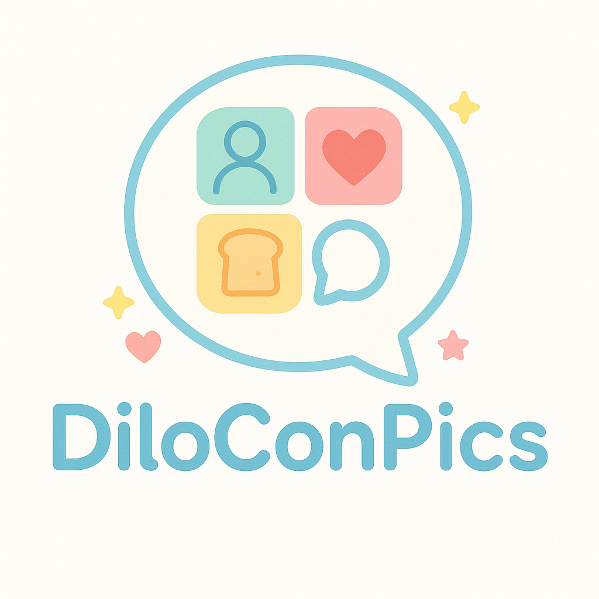

<h1 style="display:flex;align-items:center;font-size:3.2em;margin:0;">
  
  DiloConPics
</h1>

# Aplicación de pictogramas para una paciente infantil con sindrome de Prader-Willi

## Alumnas
- Henar Ronda González
- Aitana Crespo Ferrero
- Nisrine Fariss Lamine
- Carmen Ruiz Alonso
- Antonia Añazco Guenkova
---

## Introducción  

Los trastornos del habla afectan a la articulación, la fonología y la fluencia, y suelen diagnosticarse antes de los 6 años en hasta un 15 % de la población infantil 
El **síndrome de Prader-Willi (SPW)** — trastorno genético raro caracterizado por hipotonía, hiperfagia y discapacidad intelectual leve — conlleva además retraso en el lenguaje expresivo y comprensivo  

En el **Supuesto 4** se presenta el caso de una niña de cinco años con SPW, cuyas limitaciones comunicativas provocan frustración y dificultan su integración escolar y familiar. La literatura y la experiencia clínica indican que un **Sistema Aumentativo y Alternativo de Comunicación (SAAC)** basado en pictogramas y salida de voz puede mejorar significativamente su autonomía y calidad de vida.

---

## Objetivos

* **Favorecer la expresión de necesidades y emociones** de la paciente, reduciendo la frustración y los conflictos derivados de la 
* **Facilitar la comprensión** por parte de tutores, compañeros y familiares, mejorando la participación en el aula y en el hogar   
* **Promover la integración social** y prolongar al máximo la autonomía de la niña mediante una herramienta accesible y motivadora 
* Ofrecer una **plataforma extensible** que permita añadir fácilmente nuevo vocabulario y adaptarse a la evolución lingüística de la usuaria  
---

## Métodos 

Se desarrolló una aplicación web interactiva llamada **DiloConPics** empleando ```Python``` y el framework ```Streamlit```. El núcleo del programa reside en ```DiloConPics.py```, complementado por las librerías ```bcrypt``` (autenticación segura), ```gTTS``` (síntesis de voz) y ```Pillow``` (tratamiento de imágenes).

### Funciones principales:
* Registro / inicio de sesión con contraseñas *bcrypt* hash secure. 
* Navegación por categorías (“Yo”, “Emociones”, “Casa”).  
* Reproductor TTS (*gTTS*) por pictograma: la app muestra la imagen y pronuncia la palabra. 
* UI accesible, a pantalla completa y con contraste alto (CSS incluido).  
* Arquitectura extensible: basta añadir nuevas imágenes *.png* en `datos/` y listarlas en el código para ampliar vocabulario.

### Estructura:
```
├─ pics/ #contiene imagenes propias del repositorio 
├─ README.txt
├─ requirements.txt
└─ Necesidades/
  ├─ datos/ #contiene las imagenes que componen los pictogramas
  ├─ App_necesidades.py
  ├─ DiloConPics.py #version completa con auth, TTS y navegación
  ├─ logo.png
  └─ pic.jpg
```

### Uso APP online:
> Aclaración:
> La app modo online puede usarse principalmente en dispositivos Android o en ordenadores que usen navegadores propios de Google. Se ha observado fallos en el audio en dispositivos iOS.

https://diloconpics-cu2qu7ezczh42dhunmwwtr.streamlit.app/

### Uso APP local:

```
# 1. Clonar
git clone https://github.com/<TU_USUARIO>/Necesidades_Paciente.git
cd Necesidades_Paciente/

# 2. Crear y activaer entorno
conda create -n diloconpics python=3.9
conda activate diloconpics  

# 3. Instalar dependencias
pip install -r requirements.txt

# 4. Lanzar la app
streamlit run DiloConPics.py
```
## Conlusió

En conclusión, este trabajo final de la asignatura Necesidades del Paciente culmina con el desarrollo de **DiloConPics**, una app en ```Python``` + ```Streamlit``` pensada para facilitar la comunicación de la niña con SPW en su entorno familiar y escolar mediante pictogramas y síntesis de voz. Con ella esperamos reducir la frustración, fomentar su autonomía y mejorar la comprensión mutua en situaciones cotidianas.

A corto y medio plazo abrimos líneas de mejora: pulir la interfaz para hacerla aún más accesible, incorporar nuevas categorías y frases encadenadas, habilitar perfiles para profesionales y familiares, y, sobre todo, integrar las recomendaciones que emerjan del feedback real de sus usuarios. Así, DiloConPics seguirá evolucionando como herramienta viva al servicio de sus necesidades comunicativas.


